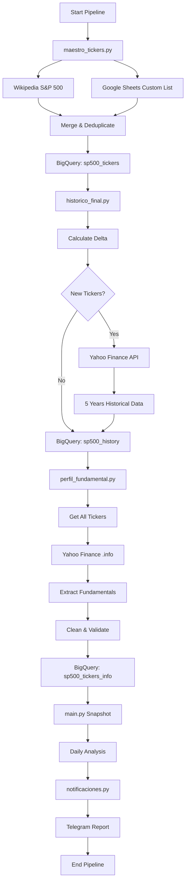
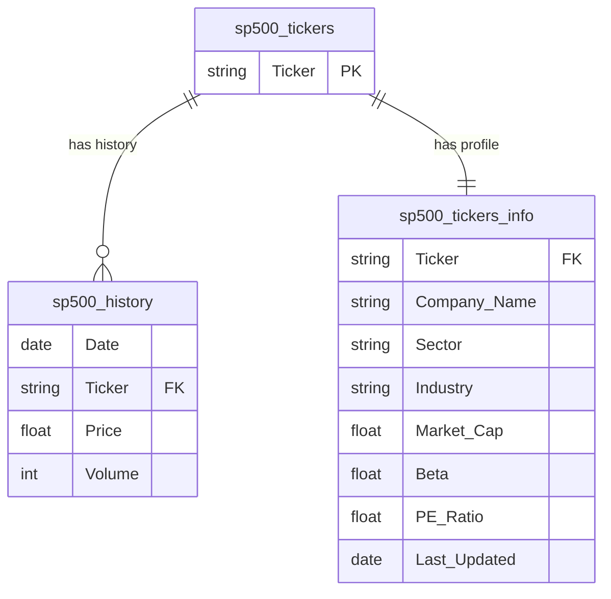

# 🏗️ Architecture - S&P 500 Finance ETL

## 🇬🇧 System Design

### Overview

The S&P 500 Finance ETL pipeline is designed as a modular, fault-tolerant system that processes financial data through multiple stages, storing results in Google BigQuery for downstream analytics.

### Design Principles

1. **Modularity**: Each component operates independently and can be run standalone
2. **Idempotency**: Safe to re-run without duplicating data
3. **Delta Processing**: Only processes missing/new data to optimize resources
4. **Error Resilience**: Isolated failures don't crash the entire pipeline
5. **Observability**: Telegram notifications for monitoring and alerts

---

## 🇪🇸 Diseño del Sistema

### Resumen

El pipeline S&P 500 Finance ETL está diseñado como un sistema modular y tolerante a fallos que procesa datos financieros a través de múltiples etapas, almacenando los resultados en Google BigQuery para análisis posteriores.

### Principios de Diseño

1. **Modularidad**: Cada componente opera independientemente y puede ejecutarse de forma aislada
2. **Idempotencia**: Seguro para re-ejecutar sin duplicar datos
3. **Procesamiento Delta**: Solo procesa datos faltantes/nuevos para optimizar recursos
4. **Resiliencia a Errores**: Fallos aislados no afectan el pipeline completo
5. **Observabilidad**: Notificaciones Telegram para monitoreo y alertas

---

## 📊 Pipeline Flow



---

## 🔧 Component Architecture

### 1. maestro_tickers.py - Master Catalog Manager

**🇬🇧 Purpose**: Maintains the authoritative list of tickers to track

**🇪🇸 Propósito**: Mantiene la lista autorizada de tickers a seguir

**Data Flow**:
```
Wikipedia S&P 500 List ────┐
                           ├──> Combine ──> Deduplicate ──> sp500_tickers
Google Sheets Watchlist ───┘
```

**Key Functions**:
- `get_sp500_from_wikipedia()`: Scrapes current S&P 500 constituents
- `get_personal_tickers_from_sheets()`: Reads custom Google Sheets watchlist
- `update_bigquery_master()`: Writes merged ticker list using `WRITE_TRUNCATE`

**Notes**:
- Handles ticker normalization (e.g., `.` → `-` for Yahoo Finance compatibility)
- `WRITE_TRUNCATE` ensures the table always reflects the current master list
- Automatically removes duplicates if a personal ticker is also in S&P 500

---

### 2. historico_final.py - Historical Data Synchronizer

**🇬🇧 Purpose**: Backfills missing historical price data

**🇪🇸 Propósito**: Rellena datos históricos de precios faltantes

**Data Flow**:
```
sp500_tickers ──> Calculate Delta ──> Yahoo Finance ──> sp500_history
                         ▲                                    │
                         └────────────────────────────────────┘
                              (Feedback: Already synced)
```

**Key Functions**:
- `obtener_tickers_faltantes()`: SQL query finds tickers in master but not in history
- `procesar_datos_yahoo()`: Transforms multi-index DataFrame to flat schema
- `subir_a_bigquery()`: Appends new historical records using `WRITE_APPEND`

**Optimization**:
- Batch processing (20 tickers per batch) to avoid API rate limits
- 5-year lookback period (`period="5y"`)
- `TICKERS_IGNORAR` list for permanently delisted/invalid tickers

**Schema**:
- Date, Ticker, Price (Close/Adj Close), Volume
- Uses `WRITE_APPEND` to preserve existing history

---

### 3. perfil_fundamental.py - Fundamental Data Enrichment

**🇬🇧 Purpose**: Updates company fundamentals and metadata

**🇪🇸 Propósito**: Actualiza datos fundamentales y metadata de empresas

**Data Flow**:
```
sp500_tickers ──> Iterate All ──> Yahoo .info API ──> Clean ──> sp500_tickers_info
```

**Key Functions**:
- `obtener_datos_fundamentales()`: Extracts `.info` dict from yfinance
- `limpiar_dataframe()`: Sanitizes nulls and invalid data
- `actualizar_tabla_info()`: Replaces entire table using `WRITE_TRUNCATE`

**Data Cleaning Rules**:
1. Drop rows without `Company_Name` (invalid tickers)
2. Fill text nulls with `"Desconocido"` (Sector, Industry, Country)
3. Fill `Dividend_Yield` nulls with `0.0` (non-dividend stocks)
4. Keep `Beta`, `PE_Ratio`, `Market_Cap` nulls as `NULL` (missing data ≠ zero)

**Extracted Fields**:
- Company_Name, Sector, Industry, Country
- Market_Cap, Beta, PE_Ratio, Forward_PE, Dividend_Yield
- Last_Updated (tracking data freshness)

---

### 4. pipeline.py - Orchestrator

**🇬🇧 Purpose**: Coordinates all pipeline components in sequence

**🇪🇸 Propósito**: Coordina todos los componentes del pipeline en secuencia

**Execution Sequence**:
```
1. maestro_tickers   → Update master catalog
2. historico_final   → Sync historical gaps
3. perfil_fundamental → Refresh fundamentals
4. main             → Daily snapshot/analysis
5. notificaciones   → Send Telegram report
```

**Features**:
- Individual error handling per stage
- Aggregate reporting with duration tracking
- Timezone-aware timestamps (America/Mexico_City)
- Continues execution even if one stage fails

---

### 5. notificaciones.py - Alert System

**🇬🇧 Purpose**: Sends pipeline status notifications via Telegram

**🇪🇸 Propósito**: Envía notificaciones de estado del pipeline vía Telegram

**Features**:
- Markdown-formatted messages
- Success/failure indicators
- Detailed error reporting
- Execution time tracking

**Configuration**:
- Requires `TELEGRAM_BOT_TOKEN` and `TELEGRAM_CHAT_ID` in `.env`
- Gracefully degrades if credentials missing (logs locally)

---

## 🗄️ Data Architecture

### BigQuery Dataset Structure

```
finance_data (dataset)
├── sp500_tickers         (Master ticker list)
├── sp500_history         (Time-series price data)
└── sp500_tickers_info    (Fundamental metadata)
```

### Table Relationships



See [docs/DATA_SCHEMA.md](./docs/DATA_SCHEMA.md) for detailed schema specifications.

---

## 🔐 Security & Authentication

### Google Cloud Authentication

The pipeline uses **Application Default Credentials (ADC)**:

```python
# Automatic credential discovery
credentials, _ = google.auth.default(scopes=scopes)
```

**🇬🇧 Authentication Flow**:
1. Checks `GOOGLE_APPLICATION_CREDENTIALS` environment variable
2. Falls back to gcloud CLI credentials
3. Uses Compute Engine service account (if running on GCP)

**🇪🇸 Flujo de Autenticación**:
1. Verifica variable de entorno `GOOGLE_APPLICATION_CREDENTIALS`
2. Usa credenciales de gcloud CLI como respaldo
3. Utiliza cuenta de servicio de Compute Engine (si se ejecuta en GCP)

### Telegram Security

- Bot token and chat ID stored in `.env` (excluded from version control)
- Environment variables validated before sending messages
- No sensitive data exposed in notifications

---

## ⚡ Performance Optimizations

### 1. Delta Processing
Only processes new tickers, not entire dataset on every run:
```sql
SELECT DISTINCT Ticker FROM sp500_tickers
WHERE Ticker NOT IN (
    SELECT DISTINCT Ticker FROM sp500_history
)
```

### 2. Batch Processing
Historical data fetched in batches of 20 to balance speed and API limits:
```python
BATCH_SIZE = 20
for i in range(0, total, BATCH_SIZE):
    lote = tickers[i:i + BATCH_SIZE]
    yf.download(lote, ...)
```

### 3. Write Strategies
- **Tickers**: `WRITE_TRUNCATE` (full refresh, small table)
- **History**: `WRITE_APPEND` (incremental, large table)
- **Info**: `WRITE_TRUNCATE` (full refresh, moderate size)

### 4. Error Isolation
Each pipeline stage wrapped in try-except to prevent cascading failures

---

## 📅 Scheduling

**🇬🇧 Default Schedule**: Daily at 3:15 PM CST (market days only)

**🇪🇸 Programación por Defecto**: Diariamente a las 3:15 PM CST (solo días de mercado)

### Why 3:15 PM CST?
- US markets close at 3:00 PM CST (4:00 PM EST)
- 15-minute buffer allows Yahoo Finance to update end-of-day data
- Avoids extended hours trading noise

### Implementation Options

**Cloud Scheduler** (Recommended for GCP):
```yaml
schedule: "15 15 * * 1-5"  # Mon-Fri at 3:15 PM
timezone: America/Mexico_City
target: Cloud Run / Cloud Functions
```

**Cron** (Self-hosted):
```cron
15 15 * * 1-5 cd /path/to/pipeline && python pipeline.py
```

**Note**: Add holiday checking logic to skip market holidays (NYSE calendar)

---

## 🔍 Monitoring & Observability

### Telegram Reports

**Success Report**:
```
🚀 *REPORTE EXITOSO*
📅 2026-03-22 15:17:34
⏱ 127.5s

✅ **Catálogo:** 505 tickers activos
📥 **Histórico:** 3 tickers procesados
📋 **Fundamentales:** Actualizados
📈 **Snapshot:** Ejecución completada
```

**Error Report**:
```
⚠️ *REPORTE CON ERRORES*
📅 2026-03-22 15:18:12
⏱ 89.2s

✅ **Catálogo:** 505 tickers activos
📥 **Histórico:** 0 tickers procesados

🛑 *Detalle de Errores:*
❌ Error Histórico: Connection timeout
```

### Logging

Each component logs to stdout:
- Progress indicators (⏳ for processing)
- Success confirmations (✅)
- Warnings (⚠️) for non-critical issues
- Errors (❌) with stack traces

### Future Enhancements

- Cloud Logging integration
- BigQuery execution logs table
- Alerting on consecutive failures
- Prometheus metrics export

---

## 🚀 Deployment Options

### 1. Cloud Run (Serverless)

**🇬🇧 Pros**: Auto-scaling, no infrastructure management, pay-per-use
**🇪🇸 Ventajas**: Escalado automático, sin gestión de infraestructura, pago por uso

```bash
gcloud run deploy finance-etl \
  --source . \
  --region us-central1 \
  --no-allow-unauthenticated
```

### 2. Cloud Functions

**🇬🇧 Pros**: Lightweight, direct Cloud Scheduler integration
**🇪🇸 Ventajas**: Ligero, integración directa con Cloud Scheduler

### 3. Compute Engine / VM

**🇬🇧 Pros**: Full control, persistent scheduling, lower cost for constant workloads
**🇪🇸 Ventajas**: Control total, programación persistente, menor costo para cargas constantes

### 4. Local / Cron

**🇬🇧 Pros**: Free, simple setup, good for development
**🇪🇸 Ventajas**: Gratis, configuración simple, ideal para desarrollo

---

## 🔄 Data Refresh Strategy

| Component | Refresh Frequency | Strategy |
|-----------|-------------------|----------|
| Ticker Catalog | Daily | Full refresh (TRUNCATE) |
| Historical Prices | Daily | Incremental (APPEND) |
| Fundamentals | Daily | Full refresh (TRUNCATE) |

**Rationale**:
- **Tickers**: Small table, quarterly S&P 500 changes → full refresh is cheap
- **History**: Grows ~500 rows/day → incremental to avoid reprocessing years of data
- **Fundamentals**: Moderate size, daily changes expected → full refresh ensures data freshness

---

## 📐 Scalability Considerations

### Current Scale
- ~505 tickers (S&P 500 + custom watchlist)
- ~5 years × 252 trading days × 505 tickers = **~635,000 historical records**
- Daily growth: ~505 new rows

### Future Scale (Phase 2 - Technical Indicators)
- Additional columns per ticker (~10-15 new indicators)
- Estimated storage increase: +40%
- BigQuery handles this easily (petabyte-scale warehouse)

### Optimization for >1000 Tickers
If expanding beyond S&P 500:
1. Increase `BATCH_SIZE` (with rate limit monitoring)
2. Parallelize Yahoo Finance calls (threading)
3. Partition BigQuery tables by date
4. Add clustering on `Ticker` column

---

**Last Updated**: March 2026
