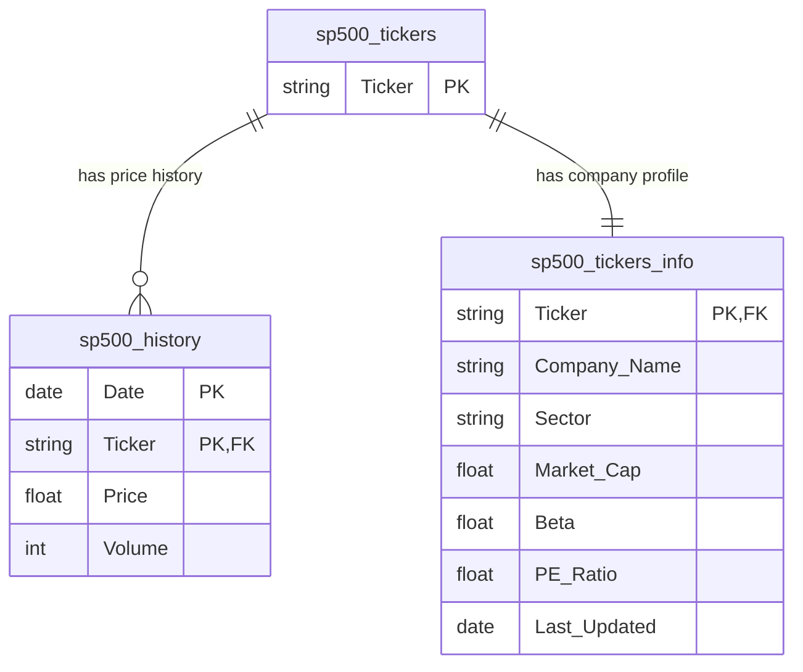

# 🗄️ Data Schema Documentation

## 🇬🇧 BigQuery Table Schemas

Complete reference for all BigQuery tables in the S&P 500 Finance ETL data warehouse.

---

## 🇪🇸 Esquemas de Tablas BigQuery

Referencia completa para todas las tablas BigQuery en el data warehouse S&P 500 Finance ETL.

---

## 📊 Dataset Overview / Resumen del Dataset

**Dataset Name / Nombre**: `finance_data`  
**Location / Ubicación**: US (or configured region)  
**Description / Descripción**: Financial data warehouse for S&P 500 stocks and custom watchlists

### Tables / Tablas

1. **sp500_tickers** - Master catalog of tracked stocks
2. **sp500_history** - Historical price and volume data
3. **sp500_tickers_info** - Company fundamentals and metadata

---

## 1️⃣ sp500_tickers - Master Ticker Catalog

### 🇬🇧 Purpose

Authoritative list of all stock tickers tracked by the pipeline. Combines S&P 500 constituents from Wikipedia with custom watchlist tickers from Google Sheets.

### 🇪🇸 Propósito

Lista autorizada de todos los tickers de acciones rastreados por el pipeline. Combina componentes del S&P 500 desde Wikipedia con tickers personalizados de Google Sheets.

---

### Schema Definition / Definición del Esquema

```sql
CREATE TABLE finance_data.sp500_tickers (
  Ticker STRING NOT NULL
)
```

### Columns / Columnas

| Column Name | Data Type | Description (EN) | Descripción (ES) |
|-------------|-----------|------------------|------------------|
| **Ticker** | STRING | Stock ticker symbol (e.g., AAPL, MSFT) | Símbolo del ticker (ej. AAPL, MSFT) |

---

### Characteristics / Características

- **🇬🇧 Primary Key**: `Ticker` (unique values)
- **🇪🇸 Clave Primaria**: `Ticker` (valores únicos)

- **🇬🇧 Update Strategy**: `WRITE_TRUNCATE` - Full table replacement daily
- **🇪🇸 Estrategia de Actualización**: `WRITE_TRUNCATE` - Reemplazo completo diario

- **🇬🇧 Row Count**: ~505 (500 S&P 500 + ~5 custom tickers)
- **🇪🇸 Conteo de Filas**: ~505 (500 S&P 500 + ~5 tickers personalizados)

---

### Sample Data / Datos de Ejemplo

```sql
SELECT * FROM finance_data.sp500_tickers LIMIT 10;
```

| Ticker |
|--------|
| AAPL   |
| MSFT   |
| GOOGL  |
| AMZN   |
| TSLA   |
| META   |
| NVDA   |
| BRK-B  |
| JPM    |
| V      |

---

### Validation Rules / Reglas de Validación

**🇬🇧 Data Quality Checks**:
1. No null values allowed in `Ticker` column
2. No duplicate tickers (deduplication enforced in `maestro_tickers.py`)
3. Ticker format: alphanumeric with optional hyphen (e.g., `BRK-B`)
4. Normalized format: dots replaced with hyphens (`BRK.B` → `BRK-B`)

**🇪🇸 Verificaciones de Calidad de Datos**:
*(Ver arriba)*

---

### Common Queries / Consultas Comunes

**🇬🇧 Get total ticker count**:
```sql
SELECT COUNT(*) as total_tickers 
FROM finance_data.sp500_tickers;
```

**🇬🇧 Find specific ticker**:
```sql
SELECT * 
FROM finance_data.sp500_tickers 
WHERE Ticker = 'AAPL';
```

**🇬🇧 Get all tickers alphabetically**:
```sql
SELECT Ticker 
FROM finance_data.sp500_tickers 
ORDER BY Ticker ASC;
```

---

## 2️⃣ sp500_history - Historical Price Data

### 🇬🇧 Purpose

Time-series storage of daily stock prices and trading volumes. Contains 5 years of historical data for all tickers in the master catalog.

### 🇪🇸 Propósito

Almacenamiento de series de tiempo de precios diarios de acciones y volúmenes de trading. Contiene 5 años de datos históricos para todos los tickers en el catálogo maestro.

---

### Schema Definition / Definición del Esquema

```sql
CREATE TABLE finance_data.sp500_history (
  Date DATE NOT NULL,
  Ticker STRING NOT NULL,
  Price FLOAT,
  Volume INTEGER
)
```

### Columns / Columnas

| Column Name | Data Type | Nullable | Description (EN) | Descripción (ES) |
|-------------|-----------|----------|------------------|------------------|
| **Date** | DATE | No | Trading date (YYYY-MM-DD) | Fecha de trading (AAAA-MM-DD) |
| **Ticker** | STRING | No | Stock ticker symbol | Símbolo del ticker |
| **Price** | FLOAT | Yes | Closing/Adjusted closing price | Precio de cierre/ajustado |
| **Volume** | INTEGER | Yes | Number of shares traded | Número de acciones negociadas |

---

### Characteristics / Características

- **🇬🇧 Composite Key**: `Date` + `Ticker` (one row per ticker per day)
- **🇪🇸 Clave Compuesta**: `Date` + `Ticker` (una fila por ticker por día)

- **🇬🇧 Update Strategy**: `WRITE_APPEND` - Incremental inserts only
- **🇪🇸 Estrategia de Actualización**: `WRITE_APPEND` - Inserciones incrementales únicamente

- **🇬🇧 Row Count**: ~635,000 (505 tickers × 5 years × 252 trading days)
- **🇪🇸 Conteo de Filas**: ~635,000 (505 tickers × 5 años × 252 días de trading)

- **🇬🇧 Daily Growth**: ~505 new rows (one per ticker)
- **🇪🇸 Crecimiento Diario**: ~505 filas nuevas (una por ticker)

---

### Sample Data / Datos de Ejemplo

```sql
SELECT * FROM finance_data.sp500_history 
WHERE Ticker = 'AAPL' 
ORDER BY Date DESC 
LIMIT 5;
```

| Date       | Ticker | Price  | Volume    |
|------------|--------|--------|-----------|
| 2026-03-21 | AAPL   | 175.43 | 58234100  |
| 2026-03-20 | AAPL   | 174.89 | 52108900  |
| 2026-03-19 | AAPL   | 176.12 | 61452300  |
| 2026-03-18 | AAPL   | 175.56 | 49887600  |
| 2026-03-17 | AAPL   | 173.24 | 55234800  |

---

### Data Sources / Fuentes de Datos

**🇬🇧 Source**: Yahoo Finance API via `yfinance` library

**Data Fields Mapping**:
- `Price` ← Yahoo Finance `Close` or `Adj Close` (adjusted for splits/dividends)
- `Volume` ← Yahoo Finance `Volume`

**Historical Period**: 5 years (`period="5y"` in `yfinance.download()`)

**🇪🇸 Fuente**: API de Yahoo Finance vía biblioteca `yfinance`

---

### Validation Rules / Reglas de Validación

**🇬🇧 Data Quality Checks**:

1. **Date Validity**
   - Must be a valid trading day (Mon-Fri, excluding holidays)
   - Cannot be in the future
   
2. **Price Validity**
   - Must be positive: `Price > 0`
   - Reasonable range: typically `0.01 < Price < 100,000`
   
3. **Volume Validity**
   - Must be non-negative: `Volume >= 0`
   - Zero volume allowed (halted stocks)
   
4. **No Duplicates**
   - Each `(Date, Ticker)` pair should appear only once
   - Enforced by delta processing logic

**🇪🇸 Verificaciones de Calidad de Datos**:
*(Ver arriba)*

---

### Common Queries / Consultas Comunes

**🇬🇧 Get latest price for all tickers**:
```sql
SELECT 
  Ticker,
  Date,
  Price,
  Volume
FROM (
  SELECT 
    Ticker,
    Date,
    Price,
    Volume,
    ROW_NUMBER() OVER (PARTITION BY Ticker ORDER BY Date DESC) as rn
  FROM finance_data.sp500_history
)
WHERE rn = 1
ORDER BY Ticker;
```

**🇬🇧 Calculate daily returns**:
```sql
SELECT 
  Date,
  Ticker,
  Price,
  LAG(Price) OVER (PARTITION BY Ticker ORDER BY Date) as Previous_Price,
  (Price - LAG(Price) OVER (PARTITION BY Ticker ORDER BY Date)) / 
    LAG(Price) OVER (PARTITION BY Ticker ORDER BY Date) * 100 as Daily_Return_Pct
FROM finance_data.sp500_history
WHERE Ticker = 'AAPL'
ORDER BY Date DESC
LIMIT 30;
```

**🇬🇧 Find top 10 most volatile stocks (30-day std dev)**:
```sql
WITH recent_data AS (
  SELECT 
    Ticker,
    Price
  FROM finance_data.sp500_history
  WHERE Date >= DATE_SUB(CURRENT_DATE(), INTERVAL 30 DAY)
)
SELECT 
  Ticker,
  STDDEV(Price) as Price_StdDev,
  AVG(Price) as Avg_Price,
  STDDEV(Price) / AVG(Price) * 100 as Coefficient_of_Variation
FROM recent_data
GROUP BY Ticker
ORDER BY Coefficient_of_Variation DESC
LIMIT 10;
```

**🇬🇧 Get historical data for specific ticker and date range**:
```sql
SELECT 
  Date,
  Price,
  Volume,
  AVG(Price) OVER (ORDER BY Date ROWS BETWEEN 19 PRECEDING AND CURRENT ROW) as SMA_20
FROM finance_data.sp500_history
WHERE Ticker = 'TSLA'
  AND Date BETWEEN '2025-01-01' AND '2025-12-31'
ORDER BY Date;
```

---

### Partitioning & Clustering Recommendations

**🇬🇧 For Large Datasets** (>1M rows):

**Partitioning by Date**:
```sql
CREATE TABLE finance_data.sp500_history_partitioned (
  Date DATE NOT NULL,
  Ticker STRING NOT NULL,
  Price FLOAT,
  Volume INTEGER
)
PARTITION BY Date
CLUSTER BY Ticker;
```

**Benefits**:
- Faster queries when filtering by date range
- Automatic partition expiration (e.g., delete data older than 10 years)
- Reduced query costs (only scan relevant partitions)

**Clustering by Ticker**:
- Groups rows by ticker for faster ticker-specific queries
- Optimal for: `WHERE Ticker = 'AAPL'` or `WHERE Ticker IN ('AAPL', 'MSFT')`

**🇪🇸 Para Datasets Grandes** (>1M filas):
*(Ver recomendaciones arriba)*

---

## 3️⃣ sp500_tickers_info - Company Fundamentals

### 🇬🇧 Purpose

Enriched metadata table containing company profiles, financial ratios, and fundamental data. Complements price history with qualitative and quantitative company information.

### 🇪🇸 Propósito

Tabla de metadata enriquecida conteniendo perfiles de empresas, ratios financieros y datos fundamentales. Complementa el histórico de precios con información cualitativa y cuantitativa de la empresa.

---

### Schema Definition / Definición del Esquema

```sql
CREATE TABLE finance_data.sp500_tickers_info (
  Ticker STRING NOT NULL,
  Company_Name STRING,
  Sector STRING,
  Industry STRING,
  Country STRING,
  Market_Cap FLOAT,
  Beta FLOAT,
  PE_Ratio FLOAT,
  Forward_PE FLOAT,
  Dividend_Yield FLOAT,
  Last_Updated DATE
)
```

### Columns / Columnas

| Column Name | Data Type | Nullable | Description (EN) | Descripción (ES) | Example |
|-------------|-----------|----------|------------------|------------------|---------|
| **Ticker** | STRING | No | Stock ticker symbol | Símbolo del ticker | AAPL |
| **Company_Name** | STRING | Yes | Full legal company name | Nombre legal completo | Apple Inc. |
| **Sector** | STRING | Yes | GICS Sector classification | Clasificación de Sector GICS | Technology |
| **Industry** | STRING | Yes | GICS Industry classification | Clasificación de Industria GICS | Consumer Electronics |
| **Country** | STRING | Yes | Country of headquarters | País de sede | United States |
| **Market_Cap** | FLOAT | Yes | Market capitalization (USD) | Capitalización de mercado (USD) | 2850000000000 |
| **Beta** | FLOAT | Yes | Volatility vs S&P 500 (β) | Volatilidad vs S&P 500 (β) | 1.23 |
| **PE_Ratio** | FLOAT | Yes | Price-to-Earnings ratio (TTM) | Ratio Precio/Ganancias (TTM) | 28.5 |
| **Forward_PE** | FLOAT | Yes | Forward P/E (next 12 months) | P/E a Futuro (próximos 12 meses) | 25.3 |
| **Dividend_Yield** | FLOAT | Yes | Annual dividend yield (%) | Rendimiento de dividendo anual (%) | 0.0052 |
| **Last_Updated** | DATE | Yes | Data freshness timestamp | Marca de tiempo de frescura | 2026-03-22 |

---

### Characteristics / Características

- **🇬🇧 Primary Key**: `Ticker` (one row per ticker)
- **🇪🇸 Clave Primaria**: `Ticker` (una fila por ticker)

- **🇬🇧 Update Strategy**: `WRITE_TRUNCATE` - Full table refresh daily
- **🇪🇸 Estrategia de Actualización**: `WRITE_TRUNCATE` - Actualización completa diaria

- **🇬🇧 Row Count**: ~505 (matches ticker catalog)
- **🇪🇸 Conteo de Filas**: ~505 (coincide con catálogo de tickers)

---

### Sample Data / Datos de Ejemplo

```sql
SELECT * FROM finance_data.sp500_tickers_info LIMIT 5;
```

| Ticker | Company_Name | Sector | Industry | Market_Cap | Beta | PE_Ratio | Dividend_Yield | Last_Updated |
|--------|--------------|--------|----------|------------|------|----------|----------------|--------------|
| AAPL | Apple Inc. | Technology | Consumer Electronics | 2.85T | 1.23 | 28.5 | 0.52% | 2026-03-22 |
| MSFT | Microsoft Corporation | Technology | Software—Infrastructure | 2.73T | 0.89 | 35.2 | 0.78% | 2026-03-22 |
| GOOGL | Alphabet Inc. | Communication Services | Internet Content & Information | 1.68T | 1.05 | 26.8 | 0.00% | 2026-03-22 |
| AMZN | Amazon.com, Inc. | Consumer Cyclical | Internet Retail | 1.52T | 1.15 | 58.3 | 0.00% | 2026-03-22 |
| TSLA | Tesla, Inc. | Consumer Cyclical | Auto Manufacturers | 785B | 2.04 | 65.7 | 0.00% | 2026-03-22 |

---

### Data Sources / Fuentes de Datos

**🇬🇧 Source**: Yahoo Finance API via `yfinance` library

**Field Mapping**:
```python
# From yfinance Ticker.info dict
Company_Name   ← info.get('longName')
Sector         ← info.get('sector')
Industry       ← info.get('industry')
Country        ← info.get('country')
Market_Cap     ← info.get('marketCap')
Beta           ← info.get('beta')
PE_Ratio       ← info.get('trailingPE')
Forward_PE     ← info.get('forwardPE')
Dividend_Yield ← info.get('dividendYield')
```

**🇪🇸 Fuente**: API de Yahoo Finance vía biblioteca `yfinance`

---

### Data Cleaning Rules / Reglas de Limpieza de Datos

**🇬🇧 Implemented in `perfil_fundamental.py`**:

1. **Null Company Name**: Row deleted (invalid ticker)
   ```python
   df = df.dropna(subset=['Company_Name'])
   ```

2. **Text Field Nulls**: Replaced with "Desconocido" (Unknown)
   ```python
   df[['Sector', 'Industry', 'Country']] = df[...].fillna('Desconocido')
   ```

3. **Dividend Yield Nulls**: Replaced with `0.0` (non-dividend paying stocks)
   ```python
   df['Dividend_Yield'] = df['Dividend_Yield'].fillna(0.0)
   ```

4. **Numeric Nulls**: Preserved as `NULL` (Beta, PE_Ratio, Market_Cap)
   - Rationale: Missing data ≠ zero value
   - Better to have NULL than misleading zero

**🇪🇸 Implementado en `perfil_fundamental.py`**:
*(Ver reglas arriba)*

---

### Field Interpretation / Interpretación de Campos

#### 🇬🇧 Beta

**What it measures**: Stock volatility relative to the market (S&P 500)

- **β = 1.0**: Moves with the market
- **β > 1.0**: More volatile than market (e.g., β=1.5 → 50% more volatile)
- **β < 1.0**: Less volatile than market (e.g., β=0.5 → 50% less volatile)
- **β < 0**: Inversely correlated with market (rare for stocks)

**Use Cases**:
- Portfolio risk assessment
- CAPM (Capital Asset Pricing Model) calculations
- Diversification strategy

#### 🇪🇸 Beta

**Qué mide**: Volatilidad de la acción relativa al mercado (S&P 500)
*(Ver interpretaciones arriba)*

---

#### 🇬🇧 PE Ratio (Price-to-Earnings)

**What it measures**: Stock price relative to company earnings

**Formula**: `PE Ratio = Stock Price / Earnings Per Share (TTM)`

**Interpretation**:
- **Low PE (< 15)**: Undervalued or low growth expectations
- **Medium PE (15-25)**: Fair value (market average)
- **High PE (> 25)**: Overvalued or high growth expectations
- **Negative PE**: Company is unprofitable (losses)
- **NULL PE**: No earnings data available

**Use Cases**:
- Valuation comparison across companies
- Identifying growth vs value stocks
- Sector analysis (Tech typically has higher PE)

#### 🇪🇸 Ratio PE (Precio/Ganancias)

**Qué mide**: Precio de acción relativo a ganancias de la empresa
*(Ver interpretaciones arriba)*

---

#### 🇬🇧 Dividend Yield

**What it measures**: Annual dividend income as percentage of stock price

**Formula**: `Dividend Yield = (Annual Dividend / Stock Price) × 100`

**Interpretation**:
- **0%**: Company does not pay dividends (growth stocks)
- **1-3%**: Moderate dividend (balanced stocks)
- **4%+**: High dividend (income stocks, REITs)
- **> 10%**: Abnormally high (verify sustainability)

**Use Cases**:
- Income investing strategies
- Yield comparison across sectors
- Dividend aristocrat screening

#### 🇪🇸 Rendimiento de Dividendo

**Qué mide**: Ingreso de dividendo anual como porcentaje del precio de acción
*(Ver interpretaciones arriba)*

---

### Validation Rules / Reglas de Validación

**🇬🇧 Data Quality Checks**:

1. **Market Cap Range**
   ```sql
   -- Flag unusually small/large market caps
   SELECT Ticker, Market_Cap 
   FROM finance_data.sp500_tickers_info
   WHERE Market_Cap < 1000000000  -- < $1B (unlikely for S&P 500)
      OR Market_Cap > 5000000000000;  -- > $5T (only AAPL/MSFT)
   ```

2. **Beta Reasonableness**
   ```sql
   -- Flag extreme betas
   SELECT Ticker, Beta 
   FROM finance_data.sp500_tickers_info
   WHERE Beta < -0.5 OR Beta > 3.0;
   ```

3. **PE Ratio Sanity**
   ```sql
   -- Flag unusual PE ratios
   SELECT Ticker, PE_Ratio 
   FROM finance_data.sp500_tickers_info
   WHERE PE_Ratio < -100  -- Highly unprofitable
      OR PE_Ratio > 500;  -- Abnormally expensive
   ```

4. **Sector Coverage**
   ```sql
   -- Check sector distribution
   SELECT Sector, COUNT(*) as count
   FROM finance_data.sp500_tickers_info
   GROUP BY Sector
   ORDER BY count DESC;
   ```

**🇪🇸 Verificaciones de Calidad de Datos**:
*(Ver consultas arriba)*

---

### Common Queries / Consultas Comunes

**🇬🇧 Top 10 companies by market cap**:
```sql
SELECT 
  Ticker,
  Company_Name,
  Market_Cap,
  Sector
FROM finance_data.sp500_tickers_info
WHERE Market_Cap IS NOT NULL
ORDER BY Market_Cap DESC
LIMIT 10;
```

**🇬🇧 Find dividend aristocrats (yield > 3%)**:
```sql
SELECT 
  Ticker,
  Company_Name,
  Dividend_Yield * 100 as Yield_Percent,
  PE_Ratio
FROM finance_data.sp500_tickers_info
WHERE Dividend_Yield > 0.03
ORDER BY Dividend_Yield DESC;
```

**🇬🇧 Compare valuation metrics by sector**:
```sql
SELECT 
  Sector,
  COUNT(*) as Num_Companies,
  AVG(PE_Ratio) as Avg_PE,
  AVG(Beta) as Avg_Beta,
  SUM(Market_Cap) / 1e12 as Total_Market_Cap_Trillions
FROM finance_data.sp500_tickers_info
WHERE PE_Ratio IS NOT NULL
GROUP BY Sector
ORDER BY Total_Market_Cap_Trillions DESC;
```

**🇬🇧 Find undervalued stocks (low PE, high beta)**:
```sql
SELECT 
  Ticker,
  Company_Name,
  PE_Ratio,
  Beta,
  Market_Cap / 1e9 as Market_Cap_Billions
FROM finance_data.sp500_tickers_info
WHERE PE_Ratio < 15
  AND PE_Ratio > 0
  AND Beta > 1.0
  AND Market_Cap > 10e9  -- Min $10B market cap
ORDER BY PE_Ratio ASC
LIMIT 20;
```

**🇬🇧 Technology sector deep dive**:
```sql
SELECT 
  Ticker,
  Company_Name,
  Industry,
  Market_Cap / 1e9 as Market_Cap_B,
  PE_Ratio,
  Beta
FROM finance_data.sp500_tickers_info
WHERE Sector = 'Technology'
ORDER BY Market_Cap DESC;
```

---

## 🔗 Cross-Table Relationships / Relaciones Entre Tablas

### 🇬🇧 Entity Relationship Diagram



### 🇪🇸 Diagrama de Relación de Entidades

*(Ver diagrama arriba)*

---

### 🇬🇧 Join Examples / Ejemplos de Join

**Combined analysis: Price + Fundamentals**:
```sql
SELECT 
  h.Ticker,
  i.Company_Name,
  i.Sector,
  h.Date,
  h.Price,
  i.PE_Ratio,
  i.Market_Cap / 1e9 as Market_Cap_B
FROM finance_data.sp500_history h
JOIN finance_data.sp500_tickers_info i
  ON h.Ticker = i.Ticker
WHERE h.Date = CURRENT_DATE()
  AND i.PE_Ratio < 20
ORDER BY h.Price DESC;
```

**Find stocks with recent price surge and low PE**:
```sql
WITH recent_returns AS (
  SELECT 
    Ticker,
    (MAX(Price) - MIN(Price)) / MIN(Price) * 100 as Return_30d
  FROM finance_data.sp500_history
  WHERE Date >= DATE_SUB(CURRENT_DATE(), INTERVAL 30 DAY)
  GROUP BY Ticker
)
SELECT 
  r.Ticker,
  i.Company_Name,
  i.Sector,
  r.Return_30d,
  i.PE_Ratio,
  i.Beta
FROM recent_returns r
JOIN finance_data.sp500_tickers_info i
  ON r.Ticker = i.Ticker
WHERE r.Return_30d > 10
  AND i.PE_Ratio < 25
  AND i.PE_Ratio > 0
ORDER BY r.Return_30d DESC;
```

---

## 📏 Data Volumes & Performance

### 🇬🇧 Current State (March 2026)

| Table | Rows | Columns | Size | Growth Rate |
|-------|------|---------|------|-------------|
| sp500_tickers | ~505 | 1 | <1 MB | Quarterly (S&P rebalancing) |
| sp500_history | ~635K | 4 | ~50 MB | +505 rows/day |
| sp500_tickers_info | ~505 | 11 | ~2 MB | Full refresh daily |

**Total Dataset Size**: ~52 MB  
**Daily Growth**: ~20 KB (historical data)

### 🇪🇸 Estado Actual (Marzo 2026)

*(Ver tabla arriba)*

---

### 🇬🇧 Query Performance Tips

1. **Always filter by date range for history queries**
   ```sql
   -- BAD: Full table scan
   SELECT * FROM sp500_history WHERE Ticker = 'AAPL';
   
   -- GOOD: Date filter reduces scan
   SELECT * FROM sp500_history 
   WHERE Ticker = 'AAPL' 
     AND Date >= DATE_SUB(CURRENT_DATE(), INTERVAL 1 YEAR);
   ```

2. **Use aggregations to reduce result size**
   ```sql
   -- Instead of returning 635K rows:
   SELECT * FROM sp500_history;
   
   -- Return summary (505 rows):
   SELECT 
     Ticker,
     COUNT(*) as data_points,
     MAX(Date) as latest_date
   FROM sp500_history
   GROUP BY Ticker;
   ```

3. **Leverage table relationships**
   ```sql
   -- Use JOINs instead of separate queries
   SELECT h.*, i.Sector, i.PE_Ratio
   FROM sp500_history h
   JOIN sp500_tickers_info i USING (Ticker)
   WHERE h.Date = CURRENT_DATE();
   ```

### 🇪🇸 Consejos de Rendimiento de Consultas

*(Ver ejemplos arriba)*

---

## 🔍 Data Lineage / Linaje de Datos

### 🇬🇧 Data Flow

```
External Sources → Python Scripts → BigQuery Tables

Wikipedia S&P 500 List ─┐
Google Sheets Watchlist ─┤
                         ├─> maestro_tickers.py ─> sp500_tickers
                         │
                         └─> historico_final.py ─> sp500_history
                                 ↑
                                 │
                         Yahoo Finance API (5y data)
                         
sp500_tickers ─> perfil_fundamental.py ─> sp500_tickers_info
                         ↑
                         │
                 Yahoo Finance API (.info)
```

### 🇪🇸 Flujo de Datos

*(Ver diagrama arriba)*

---

## 📅 Data Freshness / Frescura de Datos

### 🇬🇧 Update Schedule

| Table | Update Frequency | Last Update Field | Staleness Threshold |
|-------|------------------|-------------------|---------------------|
| sp500_tickers | Daily 3:15 PM CST | N/A | > 7 days = stale |
| sp500_history | Daily 3:15 PM CST | `Date` column | Missing today's date |
| sp500_tickers_info | Daily 3:15 PM CST | `Last_Updated` | > 2 days = stale |

**🇬🇧 Check Data Freshness**:
```sql
-- Check if today's data exists
SELECT 
  'sp500_history' as table_name,
  MAX(Date) as latest_date,
  DATE_DIFF(CURRENT_DATE(), MAX(Date), DAY) as days_old
FROM finance_data.sp500_history

UNION ALL

SELECT 
  'sp500_tickers_info' as table_name,
  MAX(Last_Updated) as latest_date,
  DATE_DIFF(CURRENT_DATE(), MAX(Last_Updated), DAY) as days_old
FROM finance_data.sp500_tickers_info;
```

### 🇪🇸 Programación de Actualizaciones

*(Ver tabla y consulta arriba)*

---

## 🛡️ Data Governance / Gobernanza de Datos

### 🇬🇧 Access Control

**Recommended IAM Roles**:

1. **Data Engineers** (Pipeline Operators):
   - `roles/big